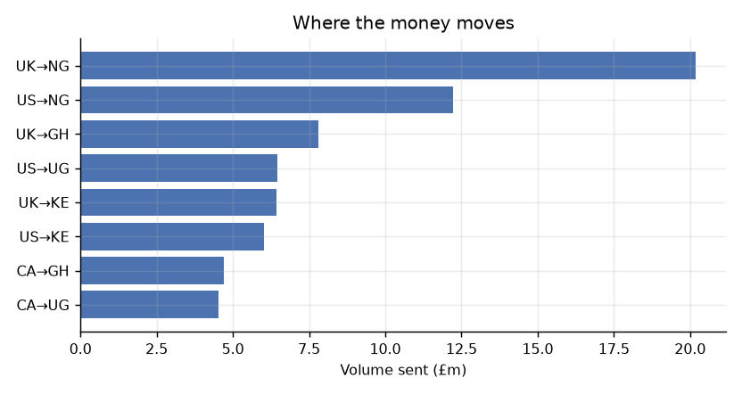
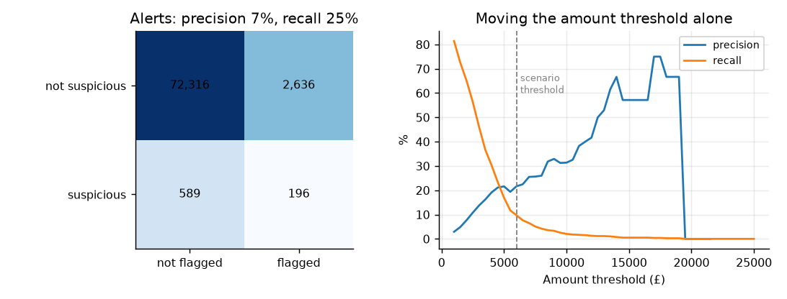
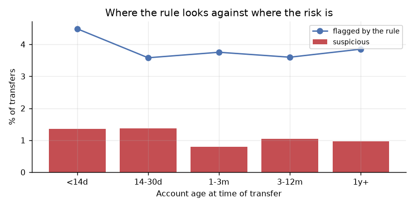
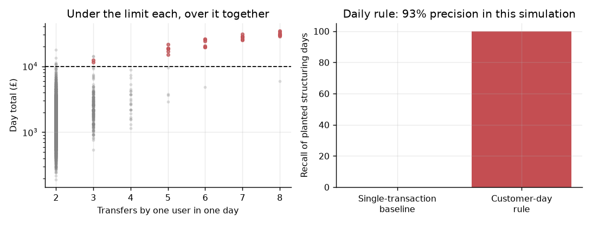
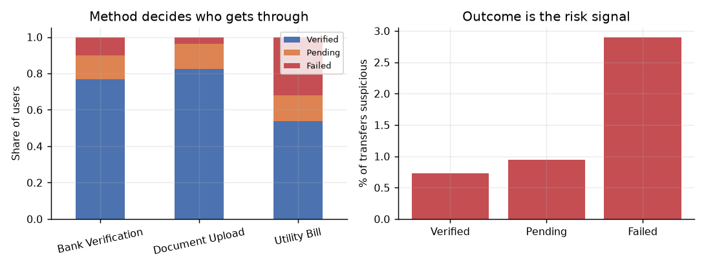

# Remittance Analytics — Junior Data Portfolio Project

Transaction monitoring for a cross-border payments business, built on simulated data. The
project answers five questions a junior data analyst might be asked and uses dbt to
model the customer-day grain needed to detect split-transfer behaviour.

```bash
pip install -r requirements.txt
python run.py
```

That command generates the data, validates and cleans it, produces the analysis and charts,
and writes `outputs/findings.md`. Every number below is generated by the pipeline.

> **Portfolio project on synthetic data.** I have not worked for LemFi and no real customer
> data is involved. The known patterns planted by the generator let me test whether the
> pipeline recovers them without leaking the ground-truth labels downstream.

---

## What I found

### 1. Volume is concentrated in a few corridors

**75,737** transfers move **£68.3m** over six months after FX-quarantined rows are excluded
from value. UK→NG alone carries **30%** of value and the top three corridors carry **59%**.
Average transfer size varies **1.6-fold** across corridors, so the impact of a single global
threshold should be checked by corridor rather than assumed.



### 2. The baseline rule misses more than it finds

Suspicious activity runs at **1.04%** of transfers. The simulated baseline rule flags
**3.7%**, catching **25%** of suspicious transfers at **7%** precision.

That creates **2,832 alerts** over six months: **2,636 false positives** and **589 missed
suspicious transfers**. It is roughly 16 alerts a day, or 0.4 of a full-time reviewer at an
illustrative capacity of 40 reviews per day. Whether that trade is acceptable depends on the
business cost of a missed case relative to a review.



### 3. New accounts are somewhat riskier

Transfers from accounts under 14 days old are suspicious **1.36%** of the time against
**1.01%** for older accounts. The elevation is real but modest, and **8%** of alerts involve
an account under 14 days old. A sensitivity test by account age would be the next step before
changing the rule.



### 4. Customer-day aggregation exposes structuring

Aggregating to **one row per customer per day** finds **28 days** with three or more transfers,
each below the **£10,000 synthetic scenario threshold**, but together above it. The total value
is **£0.7m**.

The customer-day rule recovered **26 of 26 planted structuring days** with **2 false-positive
days**: 100% recall and 93% precision in this controlled dataset. The simulated
single-transaction rule caught **0%** of the planted days.



This demonstrates the value of changing analytical grain. The precision and recall validate
the simulation and pipeline logic; they are not estimates of performance on real customers.

### 5. Verification method and outcome answer different questions

**83%** of users verified through Document Upload pass, compared with **54%** through Utility
Bill. That is primarily an operational conversion question.

Verification outcome is a separate risk signal in the scenario: suspicious activity runs at
**2.90%** among failed users and **0.72%** among verified users, roughly four times higher.



This aggregate comparison is descriptive, not causal. Changing a verification method should
be evaluated with an experiment or controlled cohort analysis before drawing a risk conclusion.

---

## The simulated data

The fixed-seed generator creates **10,000 users** and **approximately 75,700 clean
transactions** across eight corridors over six months.

The corridors loosely represent diaspora-to-home transfers from the UK, US and Canada to
Nigeria, Ghana, Kenya and Uganda. They are scenario choices, not a claim about LemFi's current
product coverage or transaction mix.

The generator includes corridor-specific volume and risk, a hidden user-level risk
propensity, a latent `is_suspicious` label and a deliberately imperfect single-transaction
flag. It also plants customer-day structuring episodes with a separate ground-truth label.

Neither ground-truth field leaves `data/raw/`. The clean extract, dbt models and candidate
rules contain only fields that could exist in a real operational dataset.

### Deliberate data-quality problems

| Planted problem | Pipeline response |
| --- | --- |
| 600 duplicated transactions | Deduplicate on `transaction_id` and report the count |
| 40 users with no home country | Retain them as `Unknown` |
| 150 corrupted exchange rates | Quarantine them from value without guessing a correction |
| 4,000 mixed-format timestamps | Parse both ISO and `dd/mm/yyyy` formats |

The pipeline fails before publishing results if a critical defect survives cleaning, including
an orphan transaction, duplicate primary key, unparseable timestamp or transfer before signup.

## Project structure

```text
run.py                        generate, validate and analyse
src/config.py                 shared Python scenario assumptions
src/generate.py               simulation and planted patterns
src/validate.py               warnings and blocking quality checks
src/analyse.py                five questions, findings and charts
tests/test_pipeline.py        unit and integration checks
dbt/lemfi_analytics/
  models/staging/             clean users and transactions
  models/marts/               corridor, KYC and customer-day models
  tests/                      reconciliation and temporal-integrity tests
outputs/findings.md           generated written findings
outputs/figures/              generated charts
```

## What this demonstrates

- Translating a business question into measurable definitions and an explicit data grain.
- Cleaning messy source data without silently inventing corrections.
- Building reusable SQL models and automated data-quality tests.
- Measuring a rule with precision, recall, false positives and operational workload.
- Separating evidence from assumptions and communicating limitations to stakeholders.

### Why warnings and failures are different

A warning is a known defect the pipeline handles and counts. A failure means the analysis
could be wrong without anyone noticing, so the pipeline stops. This keeps a deliberately messy
raw extract without allowing bad rows to silently enter the findings.

### Scenario configuration

The £10,000 value is a **synthetic scenario threshold**, not a statutory reporting threshold.
Python reads it from `src/config.py`; dbt mirrors it as a project var, and a pytest check fails
if the two values diverge. The reviewer capacity is also labelled as an illustrative
assumption rather than observed operational data.

## Running all checks

```bash
pip install -r requirements-dev.txt
python run.py
pytest -q
cd dbt/lemfi_analytics
dbt build --profiles-dir .
```

The committed dbt profile uses DuckDB and reads the clean CSVs as external sources, so no
database server or `~/.dbt` configuration is required. GitHub Actions runs the Python pipeline,
pytest and `dbt build` on every push and pull request.

## Scope and limitations

- **Not real LemFi data:** the results describe the generated scenario only.
- **Not a predictive model:** the work uses aggregation, a confusion matrix and a threshold
  curve because those methods answer the questions directly.
- **Not a complete AML programme:** sanctions, PEP screening, typologies, investigations and
  suspicious-activity reporting sit outside this narrow example.
- **Known synthetic ground truth:** this makes precision and recall measurable, but it means
  the results demonstrate the method rather than estimate live business performance.

## Built with

Python, pandas, NumPy, matplotlib, pytest, dbt and DuckDB.

**Olaoluwa Olukoya** · [github.com/Carsell](https://github.com/Carsell)
